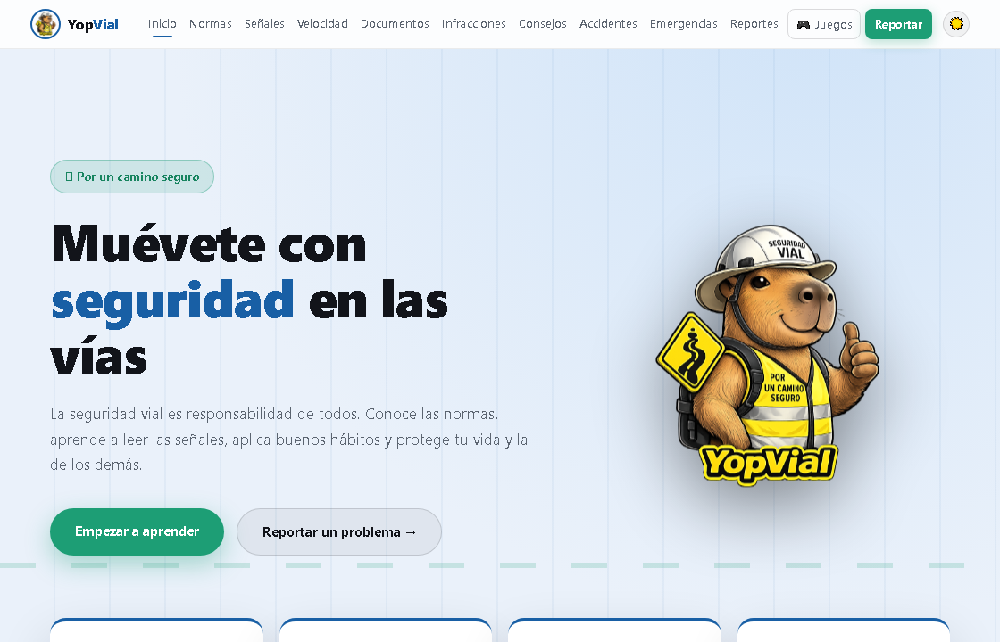
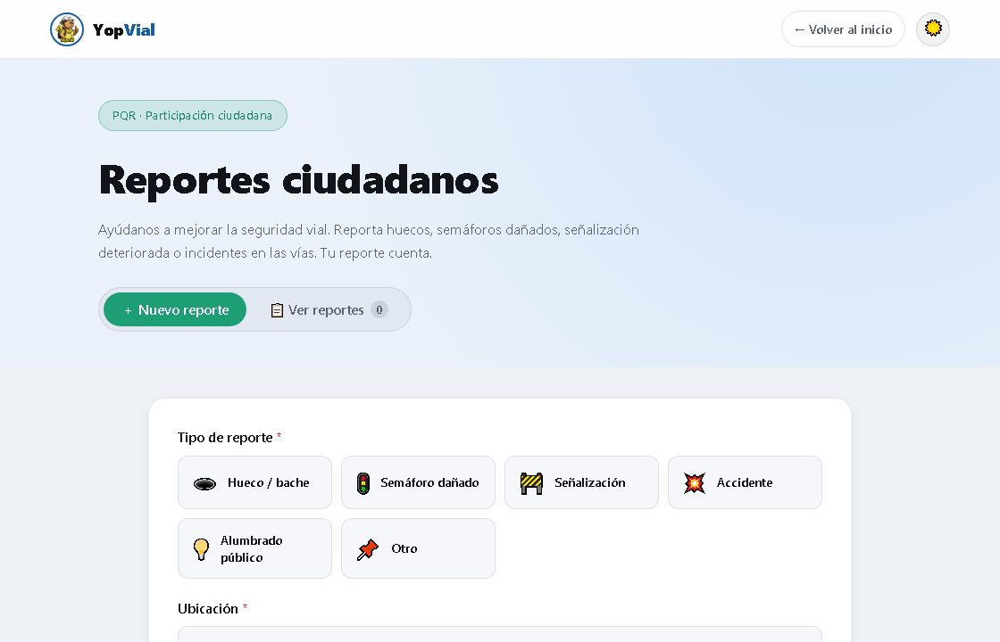
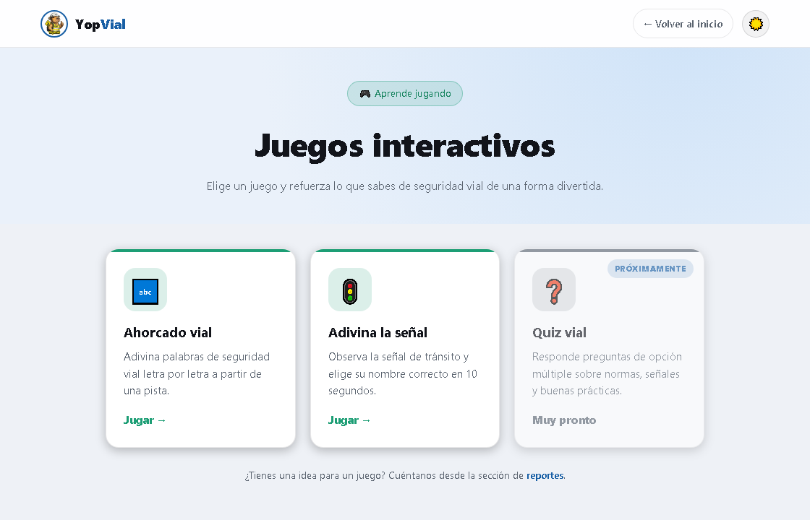
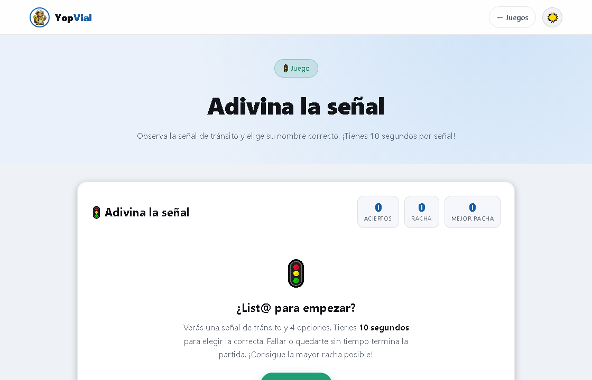
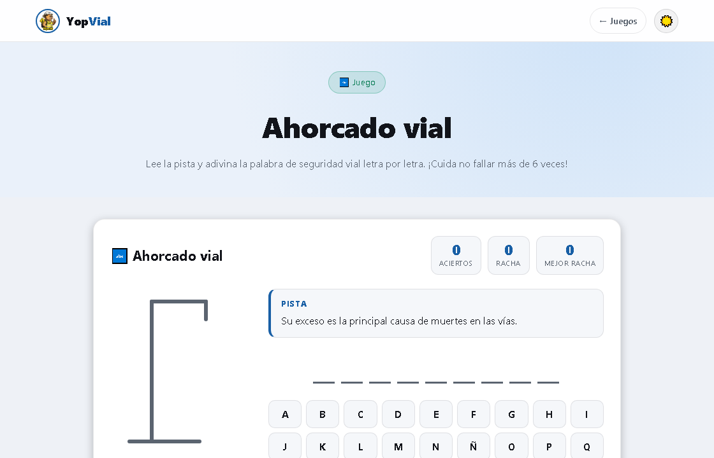

# 🦫 YopVial — Seguridad Vial

Guía educativa e interactiva de **seguridad y movilidad vial**, basada en el Código Nacional de Tránsito de Colombia (Ley 769 de 2002). Incluye contenido didáctico, un módulo de **reportes ciudadanos (PQR)** con base de datos real y una sección de **juegos interactivos** para aprender jugando.

> Mascota: **Yop**, una capibara con casco y chaleco de seguridad. Por un camino seguro. 🚦

---

## 🌐 Demo

Desplegado en GitHub Pages: **https://juanezzzzz.github.io/seguridad-vial/**

---

## 📸 Capturas

### Página principal


### Reportes ciudadanos (PQR)


### Juegos interactivos


| Adivina la señal | Ahorcado vial |
|---|---|
|  |  |

---

## ✨ Qué incluye

### Landing educativo (`index.html`)
- **Normas** clave de tránsito.
- **Señales** (reglamentarias, preventivas e informativas) con imágenes reales.
- **Límites de velocidad** por tipo de zona.
- **Documentos obligatorios** para circular (con imágenes).
- **Clasificación de infracciones** con menú desplegable (acordeón): descripción y ley de cada una.
- **Consejos** por tipo de actor vial (conductores, motociclistas, peatones, ciclistas).
- **Qué hacer en caso de accidente** y **puntos de mayor riesgo**.
- **Números de emergencia** (con imágenes).
- **Modo claro / oscuro** con paleta verde + azul (claro) y amarillo + carbón (oscuro).

### Reportes ciudadanos — PQR (`PQR/`)
Módulo de participación ciudadana para reportar huecos, semáforos dañados, señalización, accidentes, etc.
- Formulario con tipo, ubicación, gravedad, descripción y **foto opcional**.
- Los reportes se guardan en **Supabase** (base de datos compartida) y las fotos en **Supabase Storage**.
- Vista de lista con filtros, buscador y detalle.

### Juegos interactivos (`juegos/`)
Un **hub** con una card por juego; cada juego vive en su propia página:
- **🔤 Ahorcado vial** — adivina palabras de seguridad vial letra por letra a partir de una pista.
- **🚦 Adivina la señal** — opción múltiple con **10 segundos** por señal; fallar o quedarte sin tiempo termina la partida. Guarda tu mejor racha.
- **🚗 Cruza la calle** — juego arcade en **canvas** (estilo Frogger): Yop cruza la avenida esquivando el tráfico. Niveles progresivos, 3 vidas, sonido, controles de teclado y táctiles, y récord guardado. Cada cruce muestra un consejo de seguridad vial.
- **❓ Quiz vial** — *(próximamente)*.

---

## 🛠️ Tecnologías

- **HTML + CSS + JavaScript puro** (sin frameworks ni build).
- **[Supabase](https://supabase.com)** (PostgreSQL + Storage) para los reportes ciudadanos, vía el cliente ESM desde CDN.
- **GitHub Pages** para el despliegue.

---

## 📂 Estructura

```
seguridad-vial/
├── index.html            # Landing principal
├── css/styles.css        # Estilos del landing (temas claro/oscuro)
├── js/app.js             # Contenido y lógica del landing
├── assets/               # Imágenes: logo, señales, documentos, emergencias, consejos, capturas
├── PQR/                  # Módulo de reportes ciudadanos
│   ├── reportes.html
│   ├── pqr.css
│   ├── pqr.js            # Lógica con Supabase
│   └── config.js         # URL y clave pública de Supabase
├── juegos/               # Sección de juegos
│   ├── juegos.html       # Hub (cards)
│   ├── juegos.css
│   ├── ahorcado.html / ahorcado.js
│   ├── adivina-senal.html / adivina-senal.js
│   └── cruza-calle.html / cruza-calle.js   # juego arcade en canvas
└── supabase/setup.sql    # Script de tabla, RLS, vista y Storage
```

---

## ▶️ Cómo ejecutarlo localmente

El landing abre con solo doble clic, pero el módulo **PQR usa módulos ES** (`import`), así que **debe servirse por HTTP** (no con `file://`).

Con la extensión **Live Server** de VS Code (clic derecho en `index.html` → *Open with Live Server*), o desde la terminal:

```bash
# Python
python -m http.server 5500
# luego abre http://127.0.0.1:5500/
```

---

## 🗄️ Configuración de Supabase (para el módulo PQR)

1. Crea un proyecto en [supabase.com](https://supabase.com).
2. En **Storage**, crea un bucket público llamado `reportes-fotos`.
3. En **SQL Editor**, ejecuta el contenido de [`supabase/setup.sql`](supabase/setup.sql) (crea la tabla `reportes`, las políticas RLS, la vista pública `reportes_publicos` — que oculta el contacto — y la política de Storage).
4. Pon tu **Project URL** y tu **publishable/anon key** en `PQR/config.js`.

> El público solo puede **crear y ver** reportes; cambiar estado o eliminar se administra desde el panel de Supabase.

---

## 📄 Créditos

Proyecto educativo de seguridad vial. Contenido basado en la Ley 769 de 2002 (Código Nacional de Tránsito de Colombia). Con fines educativos.
