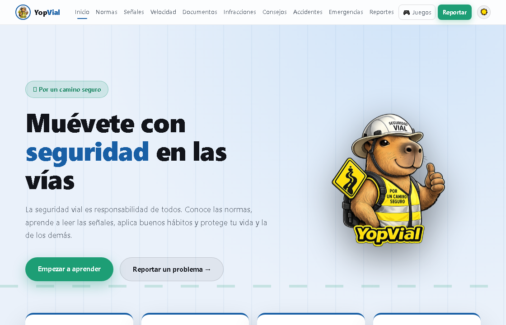
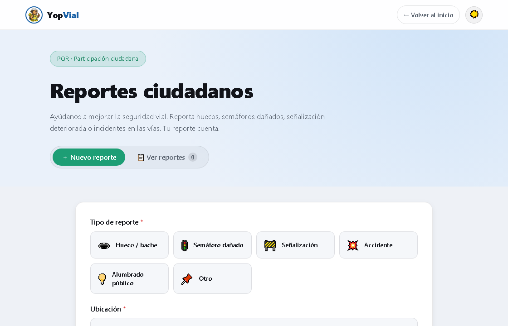
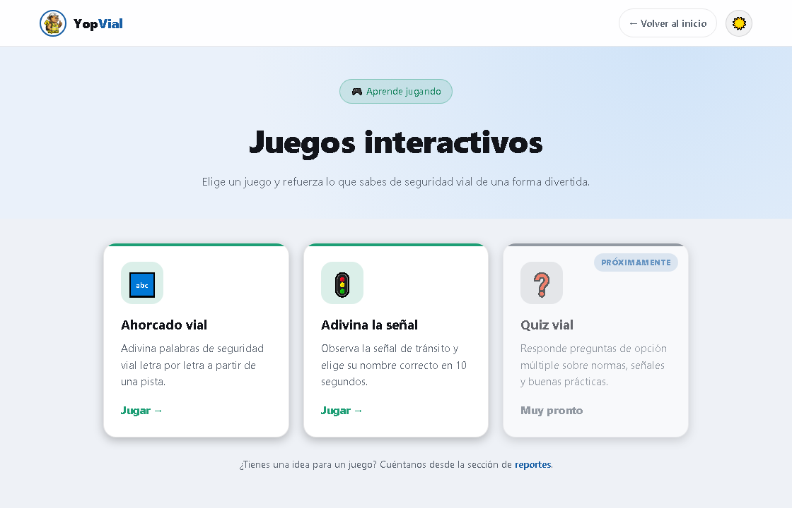
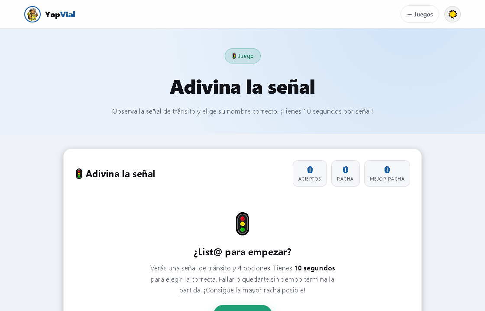
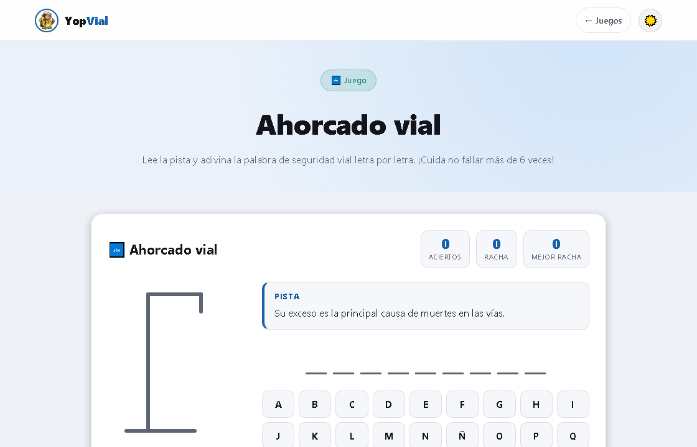

# 🦫 YopVial — Seguridad Vial

Guía educativa e interactiva de **seguridad y movilidad vial**, basada en el Código Nacional de Tránsito de Colombia (Ley 769 de 2002). Incluye contenido didáctico organizado por temas, un módulo de **reportes ciudadanos (PQR)** con base de datos real y una sección de **8 juegos interactivos** para aprender jugando.

> Mascota: **Yop**, una capibara con casco y chaleco de seguridad. Por un camino seguro. 🚦

---

## 🌐 Demo

Desplegado en GitHub Pages: **https://juanezzzzz.github.io/seguridad-vial/**

---

## 📸 Capturas

### Página principal


### Reportes ciudadanos (PQR)


### Juegos interactivos


| Adivina la señal | Ahorcado vial |
|---|---|
|  |  |

> Estas capturas son de una versión anterior del sitio; el diseño actual del hub de juegos y del home cambió (ver "Qué incluye" abajo).

---

## ✨ Qué incluye

### Landing (`index.html`)
Página corta y directa: hero, un **hub "Guía completa"** con una tarjeta por tema (cada una con la insignia de una señal vial real: forma + color según la categoría, con un ícono SVG dentro), números de emergencia siempre visibles, y acceso rápido a Reportes y Juegos.

### Guía por temas (`guia/`)
Cada tema vive en su propia página (para no hacer del home un scroll interminable), reutilizando el mismo contenido y estilos del landing:
- **Normas** clave de tránsito.
- **Señales** con imágenes reales, en cuatro pestañas: reglamentarias, preventivas, informativas de servicios (fondo azul) e informativas de destinos (fondo verde).
- **Límites de velocidad** por tipo de zona.
- **Documentos obligatorios** para circular.
- **Clasificación de infracciones** con acordeón: descripción y ley de cada una.
- **Consejos** por tipo de actor vial (conductores, motociclistas, peatones, ciclistas).
- **Qué hacer en caso de accidente**, paso a paso.
- **Puntos de mayor riesgo**.

Todas comparten `js/app.js` (contenido, renderizado y set de íconos SVG estilo Lucide, embebidos) y `css/styles.css` (modo claro/oscuro, paleta verde + azul / amarillo + carbón).

### Reportes ciudadanos — PQR (`PQR/`)
Módulo de participación ciudadana para reportar huecos, semáforos dañados, señalización, accidentes, etc.
- Formulario con tipo, ubicación, gravedad, descripción y **foto opcional**.
- Los reportes se guardan en **Supabase** (base de datos compartida) y las fotos en **Supabase Storage**.
- Vista de lista con filtros, buscador y detalle.

### Juegos interactivos (`juegos/`)
Un **hub** con una tarjeta por juego (misma insignia de señal vial que en la guía); cada juego vive en su propia página:
- **🔤 Ahorcado vial** — adivina palabras de seguridad vial letra por letra a partir de una pista.
- **🪧 Adivina la señal** — opción múltiple con **10 segundos** por señal; fallar o quedarte sin tiempo termina la partida. Guarda tu mejor racha.
- **🦫 Cruza la calle** — arcade en **canvas** (estilo Frogger): Yop cruza la avenida esquivando el tráfico. Niveles progresivos, 3 vidas, sonido, controles de teclado y táctiles, récord guardado.
- **🏍️ Ruta segura** — endless runner en moto: esquiva huecos y autos, recoge casco y SOAT, evita el celular.
- **🚦 Reflejos del semáforo** — mide tu tiempo de reacción: avanza en verde, frena antes del rojo.
- **🅿️ Parquea bien** — física de manejo simple: maniobra el carro y estaciónalo bien orientado antes de que se acabe el tiempo.
- **🌙 Ruta nocturna** — conducción nocturna con **iluminación real** (Phaser 3 + su sistema de luces): solo ves lo que entra en el cono de tus farolas, con lluvia animada y eventos de deslumbramiento.
- **❓ Quiz vial** — 24 preguntas de opción múltiple sobre normas, señales, infracciones, documentos, consejos y emergencias, contrarreloj, con explicación tras cada respuesta.

Todos los juegos guardan su mejor marca en `localStorage` y comparten tema/silencio con el resto del sitio.

---

## 🛠️ Tecnologías

- **HTML + CSS + JavaScript puro** (sin frameworks ni build) para el landing, la guía, el PQR y 7 de los 8 juegos.
- **[Phaser 3](https://phaser.io)** (vía CDN) para "Ruta nocturna", que usa su sistema de iluminación 2D y partículas.
- **[Supabase](https://supabase.com)** (PostgreSQL + Storage) para los reportes ciudadanos, vía el cliente ESM desde CDN.
- **GitHub Pages** para el despliegue.

---

## 📂 Estructura

```
seguridad-vial/
├── index.html            # Landing (hero + hub de la guía + emergencias + reportes)
├── css/styles.css        # Estilos compartidos por landing y guia/ (temas claro/oscuro)
├── js/app.js             # Contenido, renderizado e íconos SVG, compartido por landing y guia/
├── guia/                 # Un tema por página
│   ├── normas.html
│   ├── senales.html
│   ├── velocidad.html
│   ├── documentos.html
│   ├── infracciones.html
│   ├── consejos.html
│   ├── accidentes.html
│   └── zonas.html
├── assets/               # Imágenes: logo, señales reales, líneas de emergencia, capturas
│   └── ruta-nocturna/    # Arte SVG propio del juego "Ruta nocturna"
├── PQR/                  # Módulo de reportes ciudadanos
│   ├── reportes.html
│   ├── pqr.css
│   ├── pqr.js            # Lógica con Supabase
│   └── config.js         # URL y clave pública de Supabase
├── juegos/                       # Hub + 8 juegos
│   ├── juegos.html / juegos.css / juegos.js
│   ├── ahorcado.html / ahorcado.js
│   ├── adivina-senal.html / adivina-senal.js
│   ├── cruza-calle.html / cruza-calle.js       # canvas
│   ├── ruta-segura.html / ruta-segura.js       # canvas
│   ├── reflejos-semaforo.html / reflejos-semaforo.js  # canvas
│   ├── parquea-bien.html / parquea-bien.js     # canvas
│   ├── ruta-nocturna.html / ruta-nocturna.js   # Phaser 3
│   └── quiz-vial.html / quiz-vial.js
├── scripts/
│   └── smoke-test.js     # Chequeo sin dependencias: sintaxis JS + accesos DOM sin proteger
├── supabase/setup.sql    # Script de tabla, RLS, vista y Storage
├── sitemap.xml
└── robots.txt
```

---

## ▶️ Cómo ejecutarlo localmente

El landing abre con solo doble clic, pero el módulo **PQR usa módulos ES** (`import`), así que **debe servirse por HTTP** (no con `file://`).

Con la extensión **Live Server** de VS Code (clic derecho en `index.html` → *Open with Live Server*), o desde la terminal:

```bash
# Python
python -m http.server 5500
# luego abre http://127.0.0.1:5500/
```

### Antes de hacer commit

Corre el chequeo rápido (sin dependencias) que valida sintaxis de todos los scripts y detecta accesos al DOM sin proteger entre páginas:

```bash
node scripts/smoke-test.js
```

---

## 🗄️ Configuración de Supabase (para el módulo PQR)

1. Crea un proyecto en [supabase.com](https://supabase.com).
2. En **Storage**, crea un bucket público llamado `reportes-fotos`.
3. En **SQL Editor**, ejecuta el contenido de [`supabase/setup.sql`](supabase/setup.sql) (crea la tabla `reportes`, las políticas RLS, la vista pública `reportes_publicos` — que oculta el contacto — y la política de Storage).
4. Pon tu **Project URL** y tu **publishable/anon key** en `PQR/config.js`.

> El público solo puede **crear y ver** reportes; cambiar estado o eliminar se administra desde el panel de Supabase.

---

## 📄 Créditos

Proyecto educativo de seguridad vial. Contenido basado en la Ley 769 de 2002 (Código Nacional de Tránsito de Colombia). Con fines educativos.

Las señales de la guía combinan imágenes locales en `assets/senales/` con SVG oficiales enlazados desde Wikimedia Commons (*SVG road signs in Colombia*, dominio público — «PD ineligible»).
